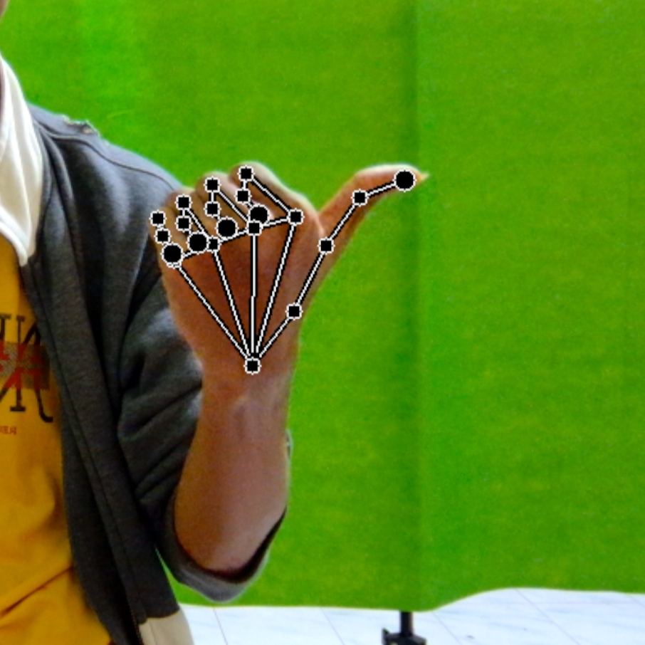

# Advanced Hand Tracking

> Advanced Hand Tracking — Real-time, smooth hand‐landmark tracking powered by MediaPipe and One Euro Filter.

<p align="center">
  
</p>

```markdown


## 🚀 Overview

Advanced Hand Tracking is a lightweight Python application for tracking 21 hand landmarks in real-time using [MediaPipe Hands](https://mediapipe.dev/) and OpenCV. Each landmark coordinate is smoothed with a One Euro Filter to reduce jitter and noise. The app also features dead-zone handling and dynamic scaling based on palm width, ensuring the landmark visualization adjusts seamlessly to the user’s hand size.


## ✨ Key Features

- 21-Point Landmark Detection
  Utilizes MediaPipe Hands to identify precise joint locations for each finger and the wrist.

- One Euro Filter for Smoothing
  Applies One Euro Filter to both X and Y coordinates of each landmark, minimizing noise without sacrificing responsiveness.

- Dynamic Scaling
  Measures palm width (distance from wrist to middle-finger base) and calculates a scale_factor, so line thickness and circle sizes adapt to hand size in real-time.

- Dead-Zone Handling  
  When the average movement of all landmarks falls below DEAD_ZONE_THRESHOLD, landmarks stay locked to their last valid positions, preventing flicker.

- Command-Line Configuration
  Supports --device, --width, --height, --min_detection_confidence, and --min_tracking_confidence for easy camera and MediaPipe tuning.

```

## 📁 Project Structure

* Advanced Hand Tracking/
* ├── assets/
* │   └── images1-6
* │   └── video
* ├── app.py
* ├── requirements.txt
* ├── README.md
* ├── LICENSE
* └── .gitignore

---

## ⚙️ Requirements

- Python 3.7+  
- OpenCV 4.9.0.80  
- MediaPipe 0.10.10

Dependencies such as numpy and argparse are pulled in automatically via opencv-python and mediapipe.

---

## 🛠️ Installation

1. Clone this repository  
   ```bash
   git clone https://github.com/username/Advanced Hand Tracking.git
   cd Advanced Hand Tracking
   ```

2. *(Optional but recommended)* Create and activate a virtual environment:

   ```bash
   python3 -m venv venv
   source venv/bin/activate        # Linux/macOS
   # venv\Scripts\activate         # Windows
   ```

3. Install dependencies

   ```bash
   pip install -r requirements.txt
   ```

4. Run the application

   ```bash
   python hand_tracking.py [ARGS]
   ```

   Example with custom arguments:

   ```bash
   python hand_tracking.py --device 0 --width 960 --height 540 \
       --min_detection_confidence 0.7 --min_tracking_confidence 0.5
   ```

---

## 🎛️ Command-Line Arguments

| Argument                     | Type    | Default | Description                                                         |
| ---------------------------- | ------- | ------- | ------------------------------------------------------------------- |
| `--device`                   | `int`   | `0`     | Camera index (0 is usually the default webcam).                     |
| `--width`                    | `int`   | `960`   | Frame width (pixels) for the output window.                         |
| `--height`                   | `int`   | `540`   | Frame height (pixels) for the output window.                        |
| `--min_detection_confidence` | `float` | `0.7`   | Minimum confidence threshold for initial hand landmark detection.   |
| `--min_tracking_confidence`  | `float` | `0.5`   | Minimum confidence threshold for landmark tracking after detection. |

> Note: If the camera cannot open or the device index is invalid, the application will exit silently.

---

## 📖 Code Breakdown

File: `hand_tracking.py`

```python
import argparse
import cv2 as cv
import mediapipe as mp
import math
import time
```

### 1. OneEuroFilter Class

```python
class OneEuroFilter:
    """Smoothing filter for noisy real-time signals."""
    def __init__(self, freq=30, mincutoff=1.0, beta=0.1, dcutoff=1.0):
        # freq: estimated frame rate (Hz)
        # mincutoff: base cutoff frequency (Hz)
        # beta: sensitivity of cutoff to the derivative (Hz)
        # dcutoff: cutoff frequency for smoothing the derivative (Hz)
        self.freq = freq
        self.mincutoff = mincutoff
        self.beta = beta
        self.dcutoff = dcutoff
        self.x_prev = None  # previous filtered value
        self.dx_prev = None # previous filtered derivative
        self.t_prev = None  # previous timestamp

    def lowpass_filter(self, x, x_prev, alpha):
        """Simple low-pass filter: α·x + (1−α)·x_prev."""
        return alpha * x + (1 - alpha) * x_prev

    def __call__(self, x, t):
        """
        Apply filter to new value x (normalized) at time t (seconds).
        Returns: filtered value x_hat.
        """
        if self.x_prev is None:
            # First call: initialize state
            self.x_prev = x
            self.dx_prev = 0.0
            self.t_prev = t
            return x

        dt = t - self.t_prev
        if dt <= 0:
            # If timestamps are invalid or equal, return previous value
            return self.x_prev

        # 1) Smooth the derivative dx
        alpha_d = math.exp(-dt * 2 * math.pi * self.dcutoff)
        dx = (x - self.x_prev) / dt
        dx_hat = self.lowpass_filter(dx, self.dx_prev, alpha_d)

        # 2) Compute adaptive cutoff frequency
        cutoff = self.mincutoff + self.beta * abs(dx_hat)
        alpha = math.exp(-dt * 2 * math.pi * cutoff)

        # 3) Filter the value x
        x_hat = self.lowpass_filter(x, self.x_prev, alpha)

        # Update internal state
        self.x_prev = x_hat
        self.dx_prev = dx_hat
        self.t_prev = t

        return x_hat
```

* freq (Hz): Estimated sampling frequency (e.g., camera at 30 FPS).
* mincutoff (Hz): Base cutoff frequency—controls how much smoothing is applied when motion is slow.
* beta (Hz): Coefficient that increases cutoff when motion accelerates, making the filter more responsive.
* dcutoff (Hz): Cutoff frequency for smoothing the derivative (`dx_hat`).

### 2. MediaPipe Hands Initialization

```python
mp_hands = mp.solutions.hands
hands = mp_hands.Hands(
    static_image_mode=False,
    max_num_hands=1,
    min_detection_confidence=args.min_detection_confidence,
    min_tracking_confidence=args.min_tracking_confidence
)
```

* Configures MediaPipe to detect up to one hand per frame.
* Returns 21 normalized landmarks (x, y in \[0, 1]) when a hand is found.

### 3. Extracting & Smoothing Landmarks

```python
# Inside the frame loop:
current_landmarks = []
for lm in hand_landmarks.landmark:
    x_px = min(int(lm.x * w), w - 1)
    y_px = min(int(lm.y * h), h - 1)
    current_landmarks.append([x_px, y_px])

# Normalize to [0, 1] and apply OneEuroFilter:
timestamp = time.time()
filtered_landmarks = []
for i, (x_px, y_px) in enumerate(current_landmarks):
    fx = filters[i]['x'](x_px / w, timestamp) * w
    fy = filters[i]['y'](y_px / h, timestamp) * h
    filtered_landmarks.append([int(fx), int(fy)])
```

* Converts normalized landmarks back to pixel coordinates (`x_px`, `y_px`).
* Normalizes pixel values by dividing by `w`/`h`, runs them through the filter, then denormalizes by multiplying by `w`/`h`.

### 4. Dynamic Scaling Based on Palm Width

```python
x0, y0 = filtered_landmarks[0]   # Wrist (landmark 0)
x9, y9 = filtered_landmarks[9]   # Middle finger base (landmark 9)
current_palm_width = math.hypot(x9 - x0, y9 - y0)

if ref_width is None:
    ref_width = current_palm_width

scale_factor = current_palm_width / ref_width
scale_factor = max(0.5, min(2.0, scale_factor))
```

* ref\_width is set once when a hand is first detected—serves as the reference palm width.
* scale\_factor = `current_palm_width / ref_width`, clamped between 0.5 and 2.0.
* Used in `draw_landmarks()` to scale line thickness and circle radii.

### 5. Dead-Zone Handling

```python
if last_valid_landmarks:
    total_movement = sum(
        math.hypot(fx - lx, fy - ly)
        for (fx, fy), (lx, ly) in zip(filtered_landmarks, last_valid_landmarks)
    )
    avg_movement = total_movement / 21

    if avg_movement < DEAD_ZONE_THRESHOLD:
        filtered_landmarks = last_valid_landmarks
```

* If the average per-landmark movement is below `DEAD_ZONE_THRESHOLD` (2.0 pixels), assume the hand is stationary.
* Keeps `filtered_landmarks` at `last_valid_landmarks` to prevent micro-flicker.

### 6. Rendering Landmarks

```python
def draw_landmarks(image, landmark_point, scale_factor=1.0):
    connections = [
        (0, 1), (1, 2), (2, 3), (3, 4),
        (0, 5), (5, 6), (6, 7), (7, 8),
        (0, 9), (9, 10), (10, 11), (11, 12),
        (0, 13), (13, 14), (14, 15), (15, 16),
        (0, 17), (17, 18), (18, 19), (19, 20),
        (5, 9), (9, 13), (13, 17)
    ]

    # Calculate thicknesses and radii based on scale_factor
    line_thick_black = max(1, int(3 * scale_factor))
    line_thick_white = max(1, int(1 * scale_factor))
    radius_tip = max(1, int(6 * scale_factor))
    radius_other = max(1, int(4 * scale_factor))
    border = max(1, int(1 * scale_factor))

    # Draw connections (black background, white border)
    for start, end in connections:
        s = tuple(landmark_point[start])
        e = tuple(landmark_point[end])
        cv.line(image, s, e, (0, 0, 0), line_thick_black)
        cv.line(image, s, e, (255, 255, 255), line_thick_white)

    # Draw each landmark point (black fill, white border)
    for i, pt in enumerate(landmark_point):
        r = radius_tip if i in [4, 8, 12, 16, 20] else radius_other
        cv.circle(image, tuple(pt), r, (0, 0, 0), -1)
        cv.circle(image, tuple(pt), r, (255, 255, 255), border)

    return image
```

* Black-filled shapes with white borders create clear contrast against varied backgrounds.
* Fingertips (indices 4, 8, 12, 16, 20) use a larger radius (`radius_tip`) to emphasize tips.
* Everything is scaled by `scale_factor` for consistent visualization across different palm widths.

---

## 🎬 Example Usage

1. Run with 1280×720 resolution

   ```bash
   python hand_tracking.py --device 0 --width 1280 --height 720
   ```

2. Run with lower confidence thresholds (e.g., in dim lighting)

   ```bash
   python hand_tracking.py --min_detection_confidence 0.5 --min_tracking_confidence 0.3
   ```

3. Combine multiple arguments

   ```bash
   python hand_tracking.py --device 1 --width 640 --height 480 \
       --min_detection_confidence 0.8 --min_tracking_confidence 0.6
   ```

* Press ESC to exit the real-time window.
* If no hand is detected, the last valid landmarks remain onscreen for up to `MAX_NO_DETECTION` frames, after which the state resets.

---

## 📦 `requirements.txt`

```txt
opencv-python==4.9.0.80
mediapipe==0.10.10
```

> Tip: For more flexibility, use `>=` instead of `==`.

---

## 📄 License

```
MIT License

Copyright (c) 2025 lAz

Permission is hereby granted, free of charge, to any person obtaining a copy
of this software and associated documentation files (the "Software"), to deal
in the Software without restriction, including without limitation the rights
to use, copy, modify, merge, publish, distribute, sublicense, and/or sell
copies of the Software, and to permit persons to whom the Software is
furnished to do so, subject to the following conditions:

[...full MIT License text...]
```

Refer to the `LICENSE` file for the complete text.

---

## 🤝 Contributing

1. Fork this repository and create a new branch:

   ```bash
   git checkout -b feature-name
   ```
2. Make your changes (ensure code follows PEP8 style).
3. Commit and push to your fork:

   ```bash
   git add .
   git commit -m "Add feature XYZ"
   git push origin feature-name
   ```
4. Open a Pull Request on GitHub with a clear description and screenshots (if applicable).

---

## 📫 Contact

* GitHub: [@username](https://github.com/lAzkhyl)
* Email: `tartareon@ugd4.my.id`

If you have questions, issues, or suggestions, please open an Issue on GitHub.

---

<p align="center">
  <sub>Made with ❤️ by lAz — Advanced Hand Tracking v1.0.0</sub>
</p>
